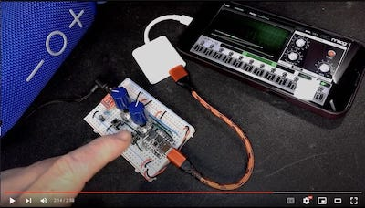
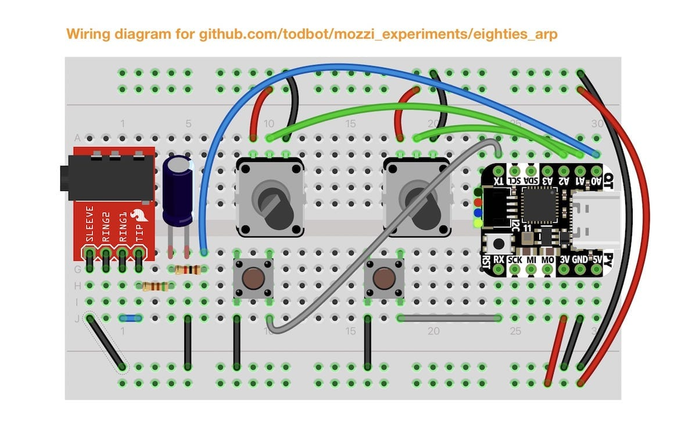

# mozzi_experiments

Experiments with Mozzi, mostly on SAMD21 chips

## Sketches

* [eighties_dystopia](eighties_dystopia/eighties_dystopia.ino) - A swirling ominous wub that evolves over time

* [eighties_dystopia_rp2040](eighties_dystopia_rp2040/eighties_dystopia_rp2040.ino) - Same thing, but on a Raspberry Pi Pico

* [eighties_arp](eighties_arp/eighties_arp.ino) - An arpeggio explorer for non-musicians and test bed for my "Arpy" arpeggio library

## Demos

* "eighties_dystopia" - See [this Twitter thread](https://twitter.com/todbot/status/1475970495400923137) or
  [this blog post on Adafruit](https://blog.adafruit.com/2021/12/29/make-your-own-80s-dystopian-music-soundtrack-qtpy-arduino-todbot/) 
  or this video below
  <video width="320" controls src="https://user-images.githubusercontent.com/274093/147687238-b004583b-c28a-47b1-984b-539541b77f9c.mp4"></video>

* "eighties_arp" - click for youtube video

  

  

## How to install Mozzi

Mozzi is not in the Arduino Library Manager, but installing it is pretty easy anyway.
The installation process is the same way you hand-install any Arduino library.

- Go to https://github.com/sensorium/Mozzi and click on the green "Code" button,
then click "Download ZIP".
- You will get a "Mozzi-master.zip" file. Rename it to "Mozzi.zip"
- In the Arduino IDE, go to "Sketch" -> "Include Library" -> "Install .ZIP library...", then pick your "Mozzi.zip" file.
- Once it completes, you will see Mozzi in the list of available libraries and the Mozzi examples
in "File" -> "Examples" -> "Mozzi".  Many of the examples will work with Scout but not use the keyboard.

## Using Mozzi

- Mozzi is very particular about what is in `loop()`. Do not put anything else in there.
  Instead put it in the `void updateControl()` function. See the sketches for examples.

## Any questions?

Open up an issue on this repo or contact me on [twitter/@todbot](https://twitter.com/todbot)!
